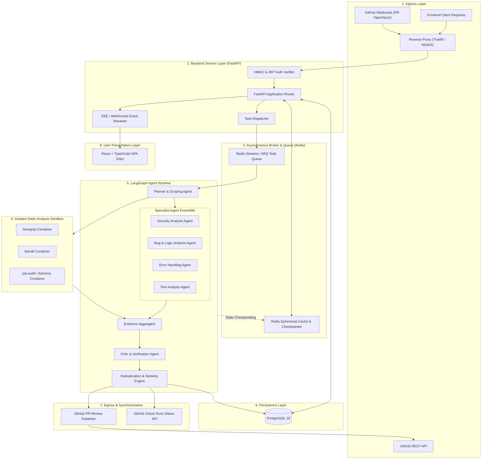
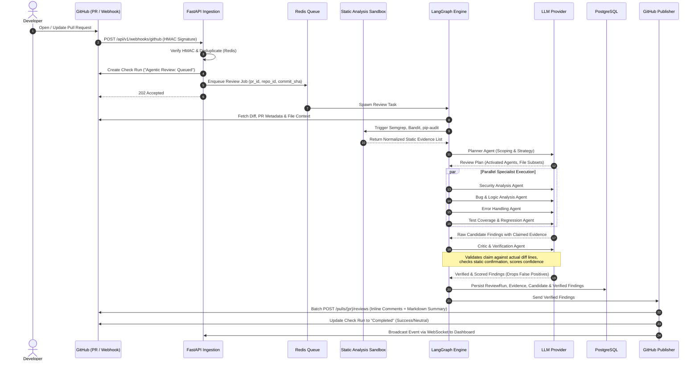
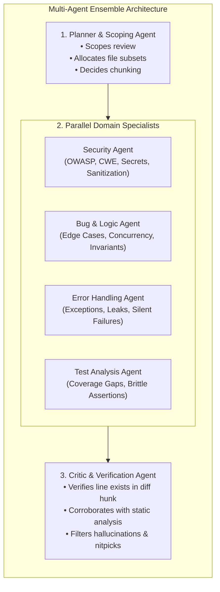
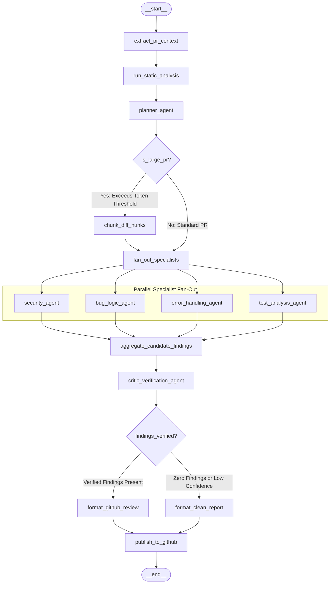
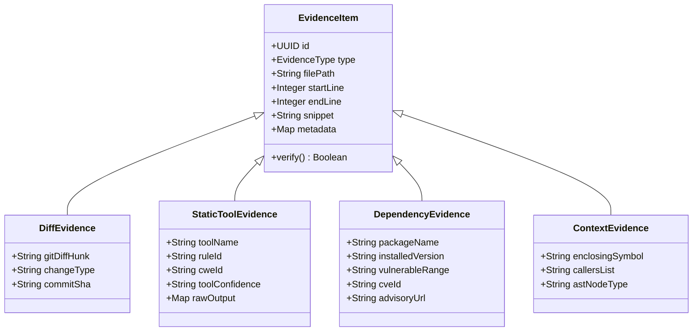
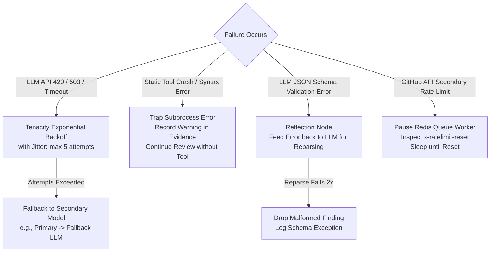
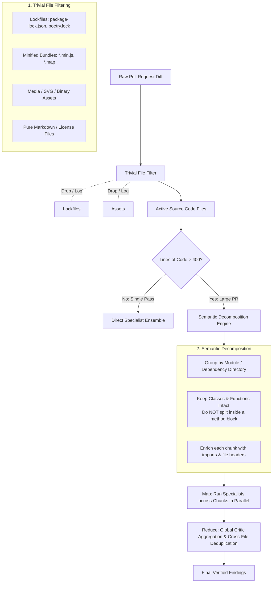
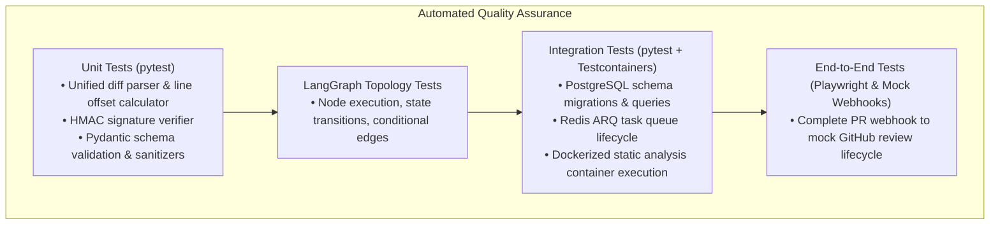

# Project Architecture Rules

- Follow modular architecture.
- Do not place business logic inside FastAPI route handlers.
- Agent orchestration must be implemented using LangGraph.
- LLM calls must be isolated behind service interfaces.
- Static analysis tools must remain independently executable.
- Findings must use the common Finding schema.
- Verification must happen before GitHub publication.
- Never publish unverified AI findings.
- Every finding must contain evidence.
- Do not hardcode API keys or secrets.
- All external API interactions must have error handling.
- Every major module must have tests.
- Prefer small, composable functions.
- Do not introduce a new dependency without justification.

---

# System Architecture & Technical Specifications

**Project Title:** An Agentic AI Framework for Reliable and Evidence-Based Automated Code Review  
**Academic Context:** Final-Year Engineering Capstone Project  
**Core Technologies:** FastAPI | LangGraph | PostgreSQL 16 | Redis | React + TypeScript | Docker | Semgrep & Bandit  

---

## Table of Contents
1. [A. Complete System Architecture](#a-complete-system-architecture)
2. [B. Component Architecture](#b-component-architecture)
3. [C. Data Flow](#c-data-flow)
4. [D. Agent Responsibilities](#d-agent-responsibilities)
5. [E. Database Architecture](#e-database-architecture)
6. [F. API Architecture](#f-api-architecture)
7. [G. LangGraph Workflow Design](#g-langgraph-workflow-design)
8. [H. GitHub Integration Design](#h-github-integration-design)
9. [I. Evidence Model](#i-evidence-model)
10. [J. Finding Schema](#j-finding-schema)
11. [K. Failure Handling Strategy](#k-failure-handling-strategy)
12. [L. Large PR and Chunking Strategy](#l-large-pr-and-chunking-strategy)
13. [M. Evaluation Architecture & Baseline Comparison](#m-evaluation-architecture--baseline-comparison)
14. [N. Security Considerations](#n-security-considerations)
15. [O. Testing Strategy](#o-testing-strategy)
16. [P. Recommended Repository Structure](#p-recommended-repository-structure)
17. [Q. Development Phases and Dependencies](#q-development-phases-and-dependencies)
18. [R. Risks and Mitigation Strategies](#r-risks-and-mitigation-strategies)

---

## A. Complete System Architecture

### 1. High-Level Architecture Diagram
The system comprises eight decoupled functional layers: Ingress, Processing & Orchestration, Static Analysis Sandbox, Multi-Agent Runtime, Persistence, Egress, Presentation, and Evaluation.



### 2. Architectural Design Decisions

#### Design Decision A.1: Task Execution Engine
- **Decision**: Selection of asynchronous background task execution engine.
- **Alternatives**:
  1. *FastAPI BackgroundTasks*: In-process, zero external dependencies, but shares memory with the web worker; tasks die on container restart; no distributed retries or fine-grained priority.
  2. *Celery*: Industry standard, feature-rich, supports Redis/RabbitMQ, but heavy, complex configuration, predominantly synchronous worker model unless gevent/eventlet is used.
  3. *ARQ (Async Redis Queue)*: Lightweight, native `asyncio`, Redis-backed, minimal boilerplate, high throughput for I/O-bound LLM workloads.
- **Recommended Approach**: **ARQ (Async Redis Queue)** for background tasks, paired with **LangGraph Async Engine**.
- **Reason**: All agent tool calling, static analysis subprocess execution, and GitHub API interactions are non-blocking I/O. ARQ runs natively in Python `asyncio`, eliminating thread-pool overhead while providing persistence and retries via Redis.

#### Design Decision A.2: Static Analysis Execution Environment
- **Decision**: Host-level CLI execution vs. Containerized Micro-Sandboxes.
- **Alternatives**:
  1. *Host-level CLI execution*: Running `semgrep`, `bandit`, and `pip-audit` directly on the FastAPI host machine via `asyncio.subprocess`.
  2. *Containerized Micro-Sandboxes*: Spawning ephemeral unprivileged Docker containers with read-only volume mounts and disabled network access.
- **Recommended Approach**: **Containerized Micro-Sandboxes** (with a fallback to strict unprivileged host processes for local testing).
- **Reason**: Pull Request code is inherently **untrusted third-party input**. Running static analysis or parsing code at the host level introduces remote code execution (RCE) and filesystem traversal vulnerabilities.

---

## B. Component Architecture

The system is decomposed into 9 autonomous components with strict boundaries:

```
+-------------------------------------------------------------------------------+
|                             COMPONENT OVERVIEW                                |
+-------------------------------------------------------------------------------+
| 1. Webhook & Auth Ingestor     | Validates HMAC-SHA256, deduplicates webhooks |
| 2. PR Context Extractor        | Fetches diffs, commits, tree, AST context    |
| 3. Static Analysis Pipeline    | Runs Semgrep, Bandit, pip-audit in sandbox   |
| 4. LangGraph Agent Runtime     | Manages state, DAG transitions, and retries  |
| 5. Multi-Agent Ensemble        | Domain-specific LLM analysis modules         |
| 6. Critic & Verification Engine| Verifies claims, grounds evidence, dedupe    |
| 7. Publisher & Synchronizer    | Translates findings to GitHub inline reviews |
| 8. Persistence Store           | Relational database for PRs, runs, findings  |
| 9. Benchmark & Eval Harness    | Compares agentic performance vs single LLM   |
+-------------------------------------------------------------------------------+
```

### 1. Webhook & Ingestor Component
- **Inputs**: Incoming HTTP POST payloads with headers `X-GitHub-Event`, `X-Hub-Signature-256`, `X-GitHub-Delivery`.
- **Responsibilities**:
  - Verify payload authenticity using secret HMAC-SHA256.
  - Filter events: only process `pull_request.opened`, `pull_request.synchronize`, `pull_request.reopened`.
  - Check idempotency: store `delivery_id` in Redis with a 24-hour TTL; reject re-deliveries.
  - Register a GitHub Check Run in `queued` state.

### 2. PR & Repository Context Extractor
- **Responsibilities**:
  - Retrieve raw git unified diffs and PR metadata (`base_sha`, `head_sha`, title, description, altered files).
  - Parse unified diff into structured hunks using a dedicated diff parser.
  - Fetch target file full contents at `head_sha` to provide enclosing class, function signatures, and context lines beyond the diff window.
  - Filter excluded files (e.g., lockfiles `package-lock.json`, minified bundles `*.min.js`, binary files, assets).

### 3. Static Analysis Pipeline
- **Responsibilities**:
  - Ingest the extracted repository snapshot.
  - Execute **Semgrep** (AST pattern matching for OWASP Top 10, security vulnerabilities, anti-patterns).
  - Execute **Bandit** (Python AST vulnerability scanner: hardcoded passwords, SQL injection, insecure crypto).
  - Execute **pip-audit** (inspect dependency declarations `requirements.txt`, `Pipfile.lock`, `pyproject.toml` against PyPA Advisory DB / OSV).
  - Normalize all outputs into a standard **Static Analysis Evidence Schema**.

### 4. LangGraph Orchestration Engine
- **Responsibilities**:
  - Execute the stateful Review DAG.
  - Persist intermediate agent state to Redis/PostgreSQL checkpointers.
  - Route execution conditionally based on PR size and file types.
  - Supervise agent retries and map-reduce aggregation.

### 5. Multi-Agent Ensemble
- Detailed in [Section D](#d-agent-responsibilities).

### 6. Critic & Verification Engine
- Detailed in [Section D](#d-agent-responsibilities) and [Section I](#i-evidence-model).

### 7. GitHub Publisher & Synchronizer
- **Responsibilities**:
  - Convert verified findings into GitHub Pull Request Review format (`POST /repos/{owner}/{repo}/pulls/{pull_number}/reviews`).
  - Calculate exact line numbers and diff position offsets (`line`, `side: RIGHT`, `start_line`).
  - Handle GitHub API rate limits and post a summarizing Check Run report with metrics.

### 8. Persistence Store & Repository Layer
- Detailed in [Section E](#e-database-architecture).

### 9. Evaluation & Benchmarking Harness
- Detailed in [Section M](#m-evaluation-architecture--baseline-comparison).

---

## C. Data Flow

The lifecycle of an automated review progresses through 8 sequential, trace-logged stages:



---

## D. Agent Responsibilities

The system replaces monolithic LLM prompts with an ensemble of domain-specialized agents orchestrated by a Planner and validated by an adversarial Critic.



### 1. Planner Agent
- **Persona / Role**: Senior Tech Lead & PR Architect.
- **Input Context**: PR title, description, list of changed files, diff statistics (additions/deletions), summary of static analysis warnings.
- **Responsibilities**:
  - Triage the PR: determine whether the changes affect security-sensitive paths (e.g., auth, payment, database schemas), application logic, infrastructure, or purely documentation.
  - Determine chunking strategy if total diff tokens exceed specialist context limits.
  - Dynamically select and route work to active specialist agents (e.g., omit Test Agent if PR contains only documentation or pure config files).
- **Tools**: `get_file_tree()`, `get_diff_summary()`, `get_static_tool_summary()`.
- **Output**: A structured `ReviewPlan` declaring active agents, target file subsets, and focus directives.

### 2. Security Analysis Agent
- **Persona / Role**: Application Security Engineer (AppSec Specialist).
- **Domain**: OWASP Top 10, CWE patterns, authentication/authorization bypasses, hardcoded secrets, injection vectors (SQL, command, XSS, SSRF), insecure deserialization, cryptographic weaknesses.
- **Input Context**: Security-relevant diff hunks, surrounding file context, Bandit and Semgrep security findings, dependency vulnerability reports from `pip-audit`.
- **Responsibilities**:
  - Investigate every static analysis security warning to confirm or refute exploitability.
  - Identify complex security vulnerabilities spanning business logic that static tools miss (e.g., missing tenant check, broken object level authorization / BOLA).
  - Demand proof of input sanitization or validation.
- **Output**: List of candidate security findings with explicit CWE mapping and exploit vector explanation.

### 3. Bug & Logic Analysis Agent
- **Persona / Role**: Senior Software Engineer & Algorithmic Specialist.
- **Domain**: Algorithmic correctness, state management, off-by-one errors, boundary condition violations, race conditions, deadlocks, unexpected `None`/null dereferencing, type mismatches.
- **Input Context**: Code diff hunks with surrounding function/class AST definitions, variable scope graphs.
- **Responsibilities**:
  - Trace variable lifecycle across altered code blocks.
  - Identify unhandled edge cases (e.g., empty lists, negative numbers, disconnected network connections).
  - Verify invariant preservation in stateful objects.
- **Output**: Candidate bug findings with step-by-step logic failure traces.

### 4. Error Handling Analysis Agent
- **Persona / Role**: Site Reliability & Resilience Engineer (SRE).
- **Domain**: Exception safety, error propagation, resource leaks (file handles, database connections, sockets), unhandled promise rejections, silent failures (e.g., `except Exception: pass`), inconsistent error contracts.
- **Input Context**: Modified control flows, try-catch/except blocks, context managers, async routines.
- **Responsibilities**:
  - Flag swallowed exceptions and blanket catch blocks that hinder observability.
  - Verify deterministic cleanup of unmanaged resources (proper usage of `with`, `finally`).
  - Ensure API endpoints return appropriate HTTP status codes on failure.
- **Output**: Candidate error-handling findings with blast radius analysis.

### 5. Test Analysis Agent
- **Persona / Role**: Quality Assurance & Software Development Engineer in Test (SDET).
- **Domain**: Test adequacy, branch coverage gaps in newly added logic, brittle mocks, tautological tests (assertions that always evaluate to true), missing regression tests for bug fixes.
- **Input Context**: Changes made to production code cross-referenced against changes made to test directories (`tests/`, `spec/`).
- **Responsibilities**:
  - Compare new branching conditions introduced in production code with corresponding unit/integration test additions.
  - Flag PRs where complex logic is introduced without any test coverage.
  - Audit existing test modifications to ensure test assertions have not been weakened to force a passing CI.
- **Output**: Candidate test quality findings and recommendations for concrete test cases.

### 6. Critic / Verification Agent
- **Persona / Role**: Principal Adversarial Code Reviewer & Grounding Verifier.
- **Responsibilities**:
  - **Hallucination Detection**: Read every candidate finding; verify that the cited `file_path` and `line_number` exist inside the added/modified lines (`+` hunks) of the PR diff.
  - **Evidence Grounding**: Cross-reference the agent's explanation against the concrete evidence item (diff snippet or static analysis rule ID). If the finding claims a variable is `None`, verify whether earlier lines in the function guarantee non-nullness.
  - **False Positive Elimination**: Discard pedantic styling complaints, subjective nitpicks, or findings already invalidated by static analysis evidence.
  - **Confidence Assignment**: Calibrate confidence score between `0.0` and `1.0`. Only findings with confidence $\ge 0.75$ are permitted to be published as PR comments.
- **Output**: List of verified, filtered, ranked findings ready for publication.

---

## E. Database Architecture

The relational schema is built on **PostgreSQL 16**. It tracks repository metadata, PR lifecycles, execution traces, static tool outputs, evidence items, candidate vs. verified findings, and evaluation benchmarks.

```mermaid
erDiagram
    REPOSITORIES ||--o{ PULL_REQUESTS : contains
    PULL_REQUESTS ||--o{ REVIEW_RUNS : triggers
    REVIEW_RUNS ||--o{ STATIC_ANALYSIS_RESULTS : produces
    REVIEW_RUNS ||--o{ EVIDENCE_ITEMS : collects
    REVIEW_RUNS ||--o{ CANDIDATE_FINDINGS : generates
    CANDIDATE_FINDINGS ||--o| VERIFIED_FINDINGS : verifies
    EVIDENCE_ITEMS ||--o{ CANDIDATE_FINDINGS : grounds
    
    EVALUATION_BENCHMARKS ||--o{ EVALUATION_RUNS : evaluates
    EVALUATION_BENCHMARKS ||--o{ GROUND_TRUTH_FINDINGS : contains
    EVALUATION_RUNS ||--o{ EVALUATION_METRIC_RESULTS : produces

    REPOSITORIES {
        uuid id PK
        bigint github_repo_id UK
        varchar full_name
        varchar default_branch
        boolean is_active
        timestamp created_at
        timestamp updated_at
    }

    PULL_REQUESTS {
        uuid id PK
        uuid repository_id FK
        integer pr_number
        varchar title
        varchar author
        varchar base_sha
        varchar head_sha
        varchar state
        integer additions
        integer deletions
        integer changed_files_count
        timestamp created_at
        timestamp updated_at
    }

    REVIEW_RUNS {
        uuid id PK
        uuid pull_request_id FK
        varchar commit_sha
        varchar status
        varchar trigger_type
        integer total_tokens
        decimal total_cost_usd
        decimal latency_seconds
        jsonb review_plan
        text error_log
        timestamp started_at
        timestamp completed_at
    }

    STATIC_ANALYSIS_RESULTS {
        uuid id PK
        uuid review_run_id FK
        varchar tool_name
        integer issues_count
        jsonb raw_output
        timestamp created_at
    }

    EVIDENCE_ITEMS {
        uuid id PK
        uuid review_run_id FK
        varchar evidence_type
        varchar file_path
        integer start_line
        integer end_line
        text content_snippet
        jsonb metadata
        timestamp created_at
    }

    CANDIDATE_FINDINGS {
        uuid id PK
        uuid review_run_id FK
        varchar agent_name
        varchar issue_type
        varchar severity
        varchar file_path
        integer line_number
        varchar side
        varchar title
        text explanation
        text recommendation
        decimal raw_confidence
        varchar status
        text rejection_reason
        timestamp created_at
    }

    VERIFIED_FINDINGS {
        uuid id PK
        uuid review_run_id FK
        uuid candidate_finding_id FK
        varchar issue_type
        varchar severity
        varchar file_path
        integer line_number
        varchar side
        varchar title
        text explanation
        text recommendation
        text code_suggestion
        decimal confidence_score
        bigint github_comment_id
        varchar publish_status
        timestamp created_at
    }

    EVALUATION_BENCHMARKS {
        uuid id PK
        varchar name
        varchar version
        text description
        timestamp created_at
    }

    GROUND_TRUTH_FINDINGS {
        uuid id PK
        uuid benchmark_id FK
        varchar pr_identifier
        varchar file_path
        integer line_number
        varchar issue_type
        varchar severity
        text description
        boolean is_true_positive
    }

    EVALUATION_RUNS {
        uuid id PK
        uuid benchmark_id FK
        varchar system_mode
        varchar model_name
        decimal precision
        decimal recall
        decimal f1_score
        decimal false_positive_rate
        decimal false_negative_rate
        decimal defect_detection_rate
        decimal avg_latency_seconds
        decimal total_cost_usd
        jsonb detailed_metrics
        timestamp created_at
    }
```



### Key PostgreSQL Constraints and Indexes
1. **Uniqueness**: `UNIQUE(repository_id, pr_number)` on `PULL_REQUESTS`.
2. **Idempotency**: `UNIQUE(pull_request_id, commit_sha)` on `REVIEW_RUNS`.
3. **Foreign Key Deletion**: `ON DELETE CASCADE` from `PULL_REQUESTS` to `REVIEW_RUNS`, cascading down to `CANDIDATE_FINDINGS` and `VERIFIED_FINDINGS`.
4. **Performance Indexes**:
   - `CREATE INDEX idx_review_runs_pr_status ON review_runs(pull_request_id, status);`
   - `CREATE INDEX idx_verified_findings_run_id ON verified_findings(review_run_id);`
   - `CREATE INDEX idx_evidence_items_run_file ON evidence_items(review_run_id, file_path);`
   - `CREATE INDEX idx_candidate_findings_status ON candidate_findings(review_run_id, status);`

---

## F. API Architecture

The FastAPI backend exposes standard REST endpoints and Server-Sent Events (SSE) for real-time frontend streaming.

```
+---------------------------------------------------------------------------------------+
|                                    API ENDPOINTS                                      |
+---------------------------------------------------------------------------------------+
| METHOD | ROUTE                                                    | PURPOSE           |
+--------+----------------------------------------------------------+-------------------+
| POST   | /api/v1/webhooks/github                                  | Webhook Ingestion |
| GET    | /api/v1/repos                                            | List Repositories |
| GET    | /api/v1/repos/{repo_id}/pulls                            | List PRs for Repo |
| GET    | /api/v1/pulls/{pr_id}/reviews                            | Review Run History|
| POST   | /api/v1/pulls/{pr_id}/reviews/trigger                    | Manual Review Run |
| GET    | /api/v1/reviews/{run_id}                                 | Run Metadata & Log|
| GET    | /api/v1/reviews/{run_id}/findings                        | Verified Findings |
| GET    | /api/v1/reviews/{run_id}/stream                          | Realtime SSE Trace|
| POST   | /api/v1/findings/{finding_id}/dismiss                    | Triage Finding    |
| POST   | /api/v1/evaluation/run                                   | Trigger Benchmark |
| GET    | /api/v1/evaluation/runs                                  | List Eval Runs    |
| GET    | /api/v1/evaluation/runs/{run_id}/comparison              | System vs Baseline|
| GET    | /api/v1/health                                           | Readiness/Liveness|
+---------------------------------------------------------------------------------------+
```

---

## G. LangGraph Workflow Design

LangGraph orchestrates the review as a stateful directed acyclic graph (DAG) with checkpoints, map-reduce fan-out, and conditional verification routing.

### 1. LangGraph State Definition
```python
from typing import TypedDict, List, Dict, Any, Optional

class ReviewState(TypedDict):
    # Context
    pull_request_id: str
    commit_sha: str
    repo_full_name: str
    pr_metadata: Dict[str, Any]
    diff_hunks: List[Dict[str, Any]]
    changed_files: List[str]
    
    # Static Analysis Evidence
    static_findings: List[Dict[str, Any]]
    dependency_advisories: List[Dict[str, Any]]
    
    # Scoping & Planning
    review_plan: Dict[str, Any]
    active_agents: List[str]
    file_chunks: List[List[Dict[str, Any]]]
    
    # Candidate Findings
    candidate_findings: List[Dict[str, Any]]
    
    # Critic & Finalization
    verified_findings: List[Dict[str, Any]]
    rejected_findings: List[Dict[str, Any]]
    execution_metrics: Dict[str, Any]
    error_messages: List[str]
```

### 2. StateGraph Node and Edge Topology



---

## H. GitHub Integration Design

### 1. Authentication: GitHub App vs. Personal Access Token (PAT)
- **Decision**: GitHub App vs. OAuth App vs. Personal Access Token (PAT).
- **Alternatives**:
  1. *PAT*: Simple string token, tied to a single user account; security hazard; hard to manage fine-grained organizational permissions.
  2. *OAuth App*: Acts on behalf of a user; cannot easily act as an independent bot with granular repository permissions.
  3. *GitHub App*: Dedicated identity, fine-grained repository permissions, automated installation tokens with 1-hour expiration, native Check Runs API access.
- **Recommended Approach**: **GitHub App**.
- **Reason**: GitHub Apps provide temporary, cryptographically signed installation access tokens (`JWT` $\to$ Installation Token via GitHub API). They have distinct bot avatars and separate API rate limits (minimum 5,000 requests/hr).

### 2. GitHub Pull Request Review API Submission
GitHub rejects review comments with a `422 Unprocessable Entity` if the cited line is not part of the active pull request diff hunk.

#### Strict Line & Side Mapping Logic
- A finding referencing added line `48` must specify:
  - `path`: `"services/order.py"`
  - `line`: `48`
  - `side`: `"RIGHT"`
- A finding referencing deleted line `46` must specify:
  - `path`: `"services/order.py"`
  - `line`: `46`
  - `side`: `"LEFT"`
- Findings referencing unchanged context files outside the diff are collected in the **General Review Body Summary** instead of inline comments to avoid GitHub API `422` rejections.

---

## I. Evidence Model

To eliminate subjective opinions and hallucinations, every finding must be grounded in an explicit, verifiable **Evidence Graph**.



### The 4 Pillars of Evidence Grounding
1. **Diff Evidence**: Concrete line coordinates in the git diff showing where the defect was introduced.
2. **Static Analysis Evidence**: Confirmation from Semgrep, Bandit, or pip-audit with explicit Rule IDs and CWE references.
3. **Context / AST Evidence**: Scope and symbol resolution (e.g., proving a variable was defined outside a block or a lock was not released).
4. **Logical Deduction Trace**: A structured reasoning chain from the specialist agent detailing the triggering input, execution path, and failure state.

---

## J. Finding Schema

Findings are validated via strict **Pydantic v2** models before persistence and egress.

```python
from pydantic import BaseModel, Field, field_validator
from typing import Optional, List, Literal
from uuid import UUID, uuid4

class EvidenceModel(BaseModel):
    evidence_type: Literal["DIFF_HUNK", "STATIC_ANALYSIS", "DEPENDENCY", "AST_CONTEXT"]
    file_path: str
    start_line: int
    end_line: int
    snippet: str
    rule_or_cve_id: Optional[str] = None
    corroborating_tool: Optional[str] = None

class ReviewFinding(BaseModel):
    finding_id: UUID = Field(default_factory=uuid4)
    issue_type: Literal[
        "SECURITY",
        "BUG_LOGIC",
        "ERROR_HANDLING",
        "TEST_ADEQUACY",
        "PERFORMANCE",
        "MAINTAINABILITY"
    ]
    severity: Literal["CRITICAL", "HIGH", "MEDIUM", "LOW", "INFO"]
    affected_file: str
    line_number: int
    side: Literal["RIGHT", "LEFT"] = "RIGHT"
    title: str = Field(..., max_length=120)
    explanation: str
    evidence: List[EvidenceModel]
    confidence_score: float = Field(..., ge=0.0, le=1.0)
    recommendation: str
    suggested_patch: Optional[str] = Field(
        None,
        description="Valid GitHub suggestion block formatted as ```suggestion\\n...\\n```"
    )
    verification_status: Literal[
        "UNVERIFIED",
        "VERIFIED",
        "SUPPRESSED_FALSE_POSITIVE",
        "DROPPED_LOW_CONFIDENCE"
    ] = "UNVERIFIED"
    critic_notes: Optional[str] = None

    @field_validator("confidence_score")
    def validate_confidence(cls, v):
        return round(v, 3)
```

---

## K. Failure Handling Strategy

Reliability in an agentic pipeline requires defensive fault tolerance against transient LLM errors, static tool crashes, and GitHub API limits.



### 1. Transient LLM Failures
- **Retry Mechanism**: Wrapped with `tenacity`. Retry on `RateLimitError`, `APIConnectionError`, `APITimeoutError` using exponential backoff with full jitter.
- **Model Fallback**: If the primary high-reasoning model fails continuously for 3 attempts, the agent runtime falls back to an alternate configured provider/model to prevent blocking PR review.

### 2. Malformed LLM Output & Schema Validation
- When an agent emits invalid JSON or fails the Pydantic schema, LangGraph routes to a **Self-Correction Node**.
- If correction fails twice, the candidate is discarded, and the error is recorded in `error_log`.

### 3. Worker Node Crashes & Idempotent Resumption
- If a container worker is terminated by the host, ARQ/Redis redelivers the unacknowledged job.
- The worker inspects PostgreSQL for existing `ReviewRun` and `ReviewState` checkpoints in Redis, resuming from the last uncompleted node.

---

## L. Large PR and Chunking Strategy

Large PRs (> 400 lines of code changed) present context exhaustion and attention degradation challenges.



---

## M. Evaluation Architecture & Baseline Comparison

```mermaid
flowchart LR
    subgraph BenchmarkDataset ["Benchmark Dataset"]
        PR_CORPUS[Curated Pull Requests<br/>• Real Open Source PRs<br/>• Synthetic Defect Injections<br/>• Verified Ground Truth Labels]
    end

    subgraph EvaluationPipeline ["Evaluation Runner"]
        RUNNER[Evaluation Test Harness]
        
        subgraph Systems ["Evaluated Systems"]
            AGENTIC[Proposed Agentic Framework<br/>(Planner + Static + Specialists + Critic)]
            BASELINE_LLM[Baseline: Single Monolithic LLM<br/>(Single prompt containing diff)]
            STATIC_ONLY[Baseline: Pure Static Analysis<br/>(Semgrep + Bandit directly)]
        end
        
        METRIC_ENGINE[Automated Scoring Engine]
    end

    subgraph MetricsOutput ["Metrics & Statistical Validation"]
        CONFUSION[Confusion Matrix:<br/>TP, FP, TN, FN]
        SCORES[Precision, Recall, F1-Score<br/>FPR, FNR, Defect Detection Rate]
        COST_LATENCY[Latency P50/P95 & Cost per PR]
        PVAL[Paired t-test / Wilcoxon Signed-Rank Test]
    end

    PR_CORPUS --> RUNNER
    RUNNER --> Systems
    Systems --> METRIC_ENGINE
    METRIC_ENGINE --> MetricsOutput
```

### 1. Benchmark Metrics Definition
- **True Positive (TP)**: System reports a genuine code defect matching a ground-truth label at the correct file and line range ($\pm 3$ lines tolerance).
- **False Positive (FP)**: System reports an issue where no defect exists (hallucination or non-issue).
- **False Negative (FN)**: System fails to report an existing ground-truth defect.
- **True Negative (TN)**: Clean/correct code inspected without generating spurious alerts.

$$\text{Precision} = \frac{\text{TP}}{\text{TP} + \text{FP}}, \quad \text{Recall} = \frac{\text{TP}}{\text{TP} + \text{FN}}, \quad \text{F1} = 2 \times \frac{\text{Precision} \times \text{Recall}}{\text{Precision} + \text{Recall}}$$

$$\text{False Positive Rate (FPR)} = \frac{\text{FP}}{\text{FP} + \text{TN}}, \quad \text{False Negative Rate (FNR)} = \frac{\text{FN}}{\text{FN} + \text{TP}}$$

$$\text{Defect Detection Rate (DDR)} = \frac{\text{Detected Ground Truth Defects}}{\text{Total Ground Truth Defects}}$$

### 2. Experimental Setup & Baselines
- **Baseline 1: Single Monolithic LLM**:
  A single call to a top-tier LLM using standard zero-shot / few-shot prompt with the raw diff.
- **Baseline 2: Static Analysis Alone**:
  Raw output of Semgrep and Bandit combined without LLM reasoning or verification.
- **Proposed System**:
  Full Agentic AI Framework with Planner, Static Analysis Evidence, 4 Specialists, and Critic Verification.

---

## N. Security Considerations

```
+-------------------------------------------------------------------------------+
|                             SECURITY ARCHITECTURE                             |
+-------------------------------------------------------------------------------+
| Threat Vector                  | Mitigation Strategy                          |
+--------------------------------+----------------------------------------------+
| Indirect Prompt Injection      | Strict XML delimiter separation; input       |
| (Malicious comments in code)   | sanitization; Critic validation of source    |
+--------------------------------+----------------------------------------------+
| Webhook Spoofing               | Mandatory HMAC-SHA256 signature verification |
|                                | before parsing JSON body                     |
+--------------------------------+----------------------------------------------+
| Remote Code Execution (RCE)   | Run Semgrep, Bandit, and pip-audit in       |
| via malicious repo scripts     | read-only, non-root, network-isolated Docker  |
+--------------------------------+----------------------------------------------+
| Secret Leakage via LLM API     | Regex/Entropy pre-scrubber (detect & mask     |
|                                | AWS keys, JWTs, credentials prior to LLM)    |
+--------------------------------+----------------------------------------------+
| Database Injection / Tampering | Parameterized queries via SQLAlchemy/SQLModel|
|                                | and strict Pydantic validation on inputs     |
+--------------------------------+----------------------------------------------+
```

---

## O. Testing Strategy



---

## P. Recommended Repository Structure

```
agentic-ai-code-reviewer/
├── .github/
│   └── workflows/
│       ├── ci.yml                 # Lint, type-check, unit & integration tests
│       └── eval-benchmark.yml     # Automated evaluation runs on commit
├── backend/
│   ├── Dockerfile
│   ├── pyproject.toml             # uv / pip dependency definition
│   ├── app/
│   │   ├── main.py                # FastAPI application factory
│   │   ├── config.py              # Pydantic BaseSettings (env vars, secrets)
│   │   ├── api/
│   │   │   ├── v1/
│   │   │   │   ├── webhooks.py    # GitHub webhook receiver
│   │   │   │   ├── reviews.py     # Review runs, findings, SSE stream
│   │   │   │   ├── repos.py       # Repository management
│   │   │   │   └── evaluation.py  # Benchmark trigger & metrics retrieval
│   │   ├── core/
│   │   │   ├── security.py        # HMAC & auth helpers
│   │   │   └── logging.py         # Structured JSON logging
│   │   ├── db/
│   │   │   ├── session.py         # Async SQLAlchemy engine
│   │   │   └── models.py          # PostgreSQL ORM models
│   │   ├── schemas/               # Pydantic request/response/finding schemas
│   │   ├── services/
│   │   │   ├── github_service.py  # GitHub API client (diffs, checks, comments)
│   │   │   ├── diff_parser.py     # Git unified diff parser
│   │   │   └── scrubber.py        # PII & Secret masking before LLM
│   │   ├── static_analysis/
│   │   │   ├── runner.py          # Dockerized analysis orchestrator
│   │   │   ├── semgrep_plugin.py  # Semgrep parser & rule runner
│   │   │   ├── bandit_plugin.py   # Bandit scanner
│   │   │   └── audit_plugin.py    # pip-audit scanner
│   │   ├── graph/
│   │   │   ├── state.py           # LangGraph TypedDict states
│   │   │   ├── workflow.py        # DAG compilation & edge definitions
│   │   │   ├── nodes/
│   │   │   │   ├── planner.py     # Scoping agent node
│   │   │   │   ├── security.py    # Security specialist node
│   │   │   │   ├── bug_logic.py   # Bug & logic specialist node
│   │   │   │   ├── error_hnd.py   # Error handling specialist node
│   │   │   │   ├── test_agent.py  # Test coverage specialist node
│   │   │   │   ├── critic.py      # Critic & verification node
│   │   │   │   └── publisher.py   # Comment formatter & check updater
│   │   └── worker.py              # ARQ async queue worker entrypoint
├── frontend/
│   ├── Dockerfile
│   ├── package.json
│   ├── vite.config.ts
│   ├── src/
│   │   ├── main.tsx
│   │   ├── App.tsx
│   │   ├── components/
│   │   │   ├── DiffViewer.tsx     # Syntax-highlighted diff with inline comments
│   │   │   ├── FindingCard.tsx    # Finding detail with evidence expansion
│   │   │   ├── LiveTrace.tsx      # SSE-driven agent execution visualizer
│   │   │   └── MetricsChart.tsx   # Precision, recall, cost graphs
│   │   ├── pages/
│   │   │   ├── Dashboard.tsx      # Recent PRs and system overview
│   │   │   ├── ReviewDetail.tsx   # Detailed review run findings & audit log
│   │   │   └── EvaluationView.tsx # Agentic vs Baseline benchmark comparison
│   │   └── services/
│   │       └── api.ts             # Axios / fetch client & SSE listener
├── evaluation/
│   ├── datasets/                  # Curated benchmark PR datasets (ground truth)
│   ├── baselines/
│   │   ├── single_llm.py          # Monolithic LLM reviewer baseline
│   │   └── static_only.py         # Raw static tools baseline
│   ├── runner.py                  # Evaluation execution harness
│   └── compute_metrics.py         # Precision, recall, F1, statistical tests
├── docker-compose.yml             # Full local stack: DB, Redis, Backend, Frontend
├── docs/
│   ├── ARCHITECTURE.md            # System Architecture & Technical Specifications
│   ├── PROJECT_SPEC.md            # Project Requirements & Scope
│   └── ROADMAP.md                 # Development Timeline & Milestones
└── README.md
```

---

## Q. Development Phases and Dependencies

Detailed milestones and execution plan are recorded in [ROADMAP.md](file:///d:/Projects/agentic-code-reviewer/docs/ROADMAP.md).

---

## R. Risks and Mitigation Strategies

```
+---------------------------------------------------------------------------------------+
|                              RISK ASSESSMENT MATRIX                                   |
+---------------------------------------------------------------------------------------+
| Risk Description              | Impact | Likelihood | Mitigation Strategy             |
+-------------------------------+--------+------------+---------------------------------+
| LLM Hallucination of Line     | HIGH   | HIGH       | Critic Agent verifies that      |
| Numbers or Non-existent Code  |        |            | file and line exist in active   |
|                               |        |            | diff hunk before publishing.    |
+-------------------------------+--------+------------+---------------------------------+
| High LLM API Latency Exceeds  | HIGH   | MEDIUM     | Parallel execution of           |
| Developer Review SLA (> 2 min)|        |            | specialists; chunk-level early  |
|                               |        |            | return; ARQ background queuing. |
+-------------------------------+--------+------------+---------------------------------+
| Developer Alert Fatigue from  | HIGH   | HIGH       | Confidence threshold cutoff     |
| Nitpick / Style False Alerts  |        |            | (score >= 0.75); suppress style |
|                               |        |            | comments; enforce evidence link.|
+-------------------------------+--------+------------+---------------------------------+
| GitHub API Secondary Rate     | MEDIUM | MEDIUM     | Single batch review submission  |
| Limits from Rapid Commenting  |        |            | per PR run; exponential backoff |
|                               |        |            | on HTTP 403/429.                |
+-------------------------------+--------+------------+---------------------------------+
| Excessive Token Costs during  | MEDIUM | HIGH       | Exclude lockfiles/assets;       |
| Large PR Processing           |        |            | hierarchical chunking; caching  |
|                               |        |            | of static analysis results.     |
+-------------------------------+--------+------------+---------------------------------+
```