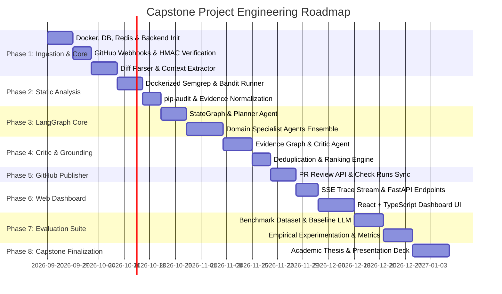

# Project Roadmap & Implementation Milestones

**Project Title:** An Agentic AI Framework for Reliable and Evidence-Based Automated Code Review  
**Project Repository:** [agentic-ai-code-reviewer](https://github.com/BhosaleSaksh/agentic-ai-code-reviewer.git)  

---

## 1. Roadmap Overview

The project is structured into **8 sequential development phases**. Each phase defines explicit objectives, technical deliverables, dependencies, and verifiable acceptance criteria.



---

## 2. Phase-by-Phase Breakdown

### Phase 1: Foundation, Ingestion & Core Infrastructure
- **Objectives:** Establish the core infrastructure, database models, asynchronous queue, GitHub App webhook ingestion, and git diff parsing.
- **Key Deliverables:**
  1. `docker-compose.yml` configuring PostgreSQL 16 and Redis 7.
  2. Backend initialization with FastAPI, Pydantic v2, and SQLAlchemy (async).
  3. Database models (`Repository`, `PullRequest`, `ReviewRun`, `EvidenceItem`, `Finding`) with Alembic migrations.
  4. Webhook ingestion endpoint (`POST /api/v1/webhooks/github`) with HMAC-SHA256 signature verification and delivery deduplication.
  5. ARQ worker configuration for background job processing.
  6. Git unified diff parser extracting added/modified/deleted hunks, file paths, and line coordinates.
- **Dependencies:** None.
- **Acceptance Criteria:**
  - `pytest tests/unit/test_diff_parser.py` passes with $100\%$ hunk boundary accuracy.
  - Webhooks from GitHub receive `202 Accepted` and successfully enqueue an ARQ job.
  - Invalid HMAC signatures are rejected with `401 Unauthorized`.

---

### Phase 2: Static Analysis Pipeline & Tool Sandboxing
- **Objectives:** Integrate Semgrep, Bandit, and pip-audit in containerized sandboxes, transforming their outputs into unified static evidence.
- **Key Deliverables:**
  1. Ephemeral runner executing Semgrep with security and bug rule packs.
  2. Python AST scanner executing Bandit on modified Python files.
  3. Dependency auditor executing `pip-audit` against lockfiles/dependency declarations.
  4. Output normalizers converting tool-specific JSON into standardized `StaticAnalysisResult` records.
  5. Timeout and error trap mechanisms ensuring tool crashes do not halt the review.
- **Dependencies:** Phase 1.
- **Acceptance Criteria:**
  - Automated tests verify that synthetic vulnerable snippets (e.g., SQL injection, hardcoded secrets, known vulnerable packages) trigger expected static evidence records.
  - Sandbox execution enforces non-root user privileges and memory caps.

---

### Phase 3: LangGraph Agent Core & Domain Specialists
- **Objectives:** Construct the stateful LangGraph orchestration pipeline with checkpointers and build the four specialized analysis agents.
- **Key Deliverables:**
  1. LangGraph `StateGraph` definition with `ReviewState` and async Redis/Postgres checkpointer.
  2. **Planner Agent**: Analyzes PR metadata and static analysis summaries to generate a structured `ReviewPlan` and chunking strategy.
  3. **Security Analysis Agent**: Investigates OWASP vulnerabilities, CWE patterns, and validates static security findings.
  4. **Bug & Logic Analysis Agent**: Traces algorithmic invariants, boundary conditions, null dereferencing, and concurrency issues.
  5. **Error Handling Agent**: Detects swallowed exceptions, resource leaks, and improper error status codes.
  6. **Test Analysis Agent**: Evaluates test coverage adequacy and regression risks for modified branches.
- **Dependencies:** Phase 2.
- **Acceptance Criteria:**
  - Specialist agents execute in parallel via LangGraph fan-out.
  - Every candidate finding matches the strict Pydantic `ReviewFinding` schema.
  - Intermediate state is safely checkpointed to allow recovery from mid-run failures.

---

### Phase 4: Critic & Grounded Evidence Verification Engine
- **Objectives:** Implement the adversarial Critic Agent to ground claims in concrete evidence and filter out hallucinations and false positives.
- **Key Deliverables:**
  1. Evidence graph aggregator linking candidate claims to diff hunks, static rule IDs, and AST context.
  2. **Critic & Verification Agent**:
     - Confirms cited file paths and line numbers exist in the modified diff hunks (`+` side).
     - Cross-checks agent claims against static analysis outputs.
     - Calibrates confidence scores between `0.0` and `1.0`.
     - Suppresses findings with confidence $< 0.75$ or subjective styling complaints.
  3. Deduplication and ranking engine combining overlapping findings from multiple specialists into unified, high-priority issues.
- **Dependencies:** Phase 3.
- **Acceptance Criteria:**
  - Simulated hallucinated findings (non-existent lines or files) are 100% caught and dropped by the Critic.
  - Candidate findings with verified static tool corroboration receive boosted confidence scores ($\ge 0.85$).

---

### Phase 5: GitHub Review Publisher & Egress Synchronization
- **Objectives:** Publish verified findings to GitHub as inline Pull Request review comments and synchronize Check Run statuses.
- **Key Deliverables:**
  1. GitHub App authentication service generating short-lived installation access tokens.
  2. PR Review API client submitting batch reviews with inline comments and markdown summary bodies.
  3. Precise line and side (`RIGHT` / `LEFT`) position mapping preventing GitHub API `422 Unprocessable Entity` errors.
  4. One-click GitHub suggestion code formatting (````suggestion ... ````).
  5. GitHub Check Runs updater transitioning statuses: `queued` $\to$ `in_progress` $\to$ `completed` with summary annotations.
- **Dependencies:** Phase 4.
- **Acceptance Criteria:**
  - Verified findings appear directly as inline comments on the target PR diff on GitHub.
  - Zero `422 Unprocessable Entity` errors during review publication.

---

### Phase 6: Web Dashboard & Real-Time Visualization
- **Objectives:** Build an interactive React + TypeScript web application with real-time SSE execution tracing and finding management.
- **Key Deliverables:**
  1. FastAPI Server-Sent Events (SSE) streaming endpoint (`GET /api/v1/reviews/{run_id}/stream`) emitting agent lifecycle events.
  2. React + TypeScript frontend initialized with Vite.
  3. Real-time **Live Trace Viewer** showing active agents, node transitions, and intermediate reasoning.
  4. **Diff & Finding Explorer** rendering syntax-highlighted code diffs with expandable evidence cards.
  5. Finding triage controls allowing developers to mark findings as dismissed or helpful.
- **Dependencies:** Phase 5.
- **Acceptance Criteria:**
  - Dashboard updates live via SSE without page refresh as agents progress through the review DAG.
  - Responsive, dark-mode-first aesthetic matching modern developer tooling standards.

---

### Phase 7: Evaluation Framework & Empirical Baseline Study
- **Objectives:** Construct an empirical evaluation framework comparing the agentic system against a single-LLM monolithic baseline.
- **Key Deliverables:**
  1. Curated benchmark dataset of Pull Requests with verified ground-truth defect annotations.
  2. Single-LLM monolithic reviewer baseline module (single zero-shot prompt on the diff).
  3. Static-only baseline module (raw Semgrep + Bandit outputs).
  4. Automated evaluation test harness computing:
     - Precision, Recall, F1-Score
     - False Positive Rate (FPR), False Negative Rate (FNR)
     - Defect Detection Rate (DDR)
     - Execution Latency (P50, P90, P95) and Token/API Cost (USD)
  5. Statistical validation engine running paired t-tests / Wilcoxon signed-rank tests.
  6. Dashboard evaluation view visualizing comparative radar and bar charts.
- **Dependencies:** Phase 6.
- **Acceptance Criteria:**
  - Empirical evaluation proves statistically significant reduction in False Positive Rate ($\ge 40\%$ reduction vs. single-LLM baseline).
  - Reproducible benchmark runner executable via a single CLI command (`python -m evaluation.runner`).

---

### Phase 8: Project Finalization & Capstone Dissertation
- **Objectives:** Finalize project documentation, academic dissertation, and demo assets for the capstone presentation.
- **Key Deliverables:**
  1. Comprehensive capstone project report / engineering dissertation.
  2. Recorded system demonstration showcasing automated PR review on real GitHub repositories.
  3. Final presentation slide deck.
  4. Clean open-source repository release with complete documentation and automated GitHub Actions CI.
- **Dependencies:** Phase 7.
- **Acceptance Criteria:**
  - Full CI build passing with linting, typing, unit, and integration tests.
  - Complete thesis report detailing architecture, methodology, evaluation, and empirical results.
